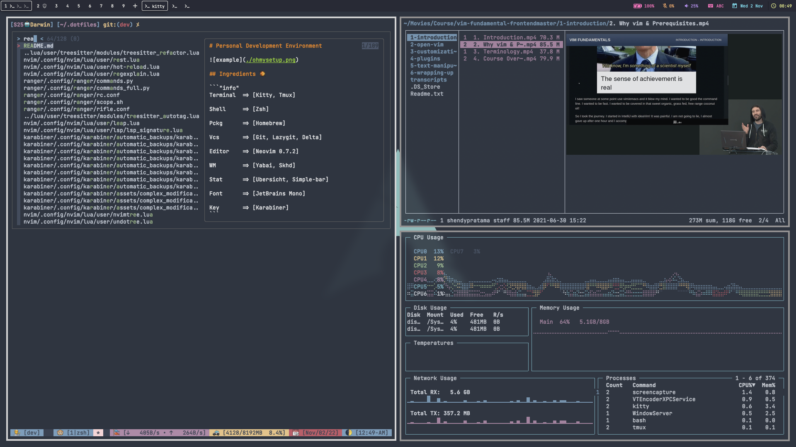

# Personal Development Environment



## Ingredients 🥘

```"info"
Terminal  => [Kitty, Tmux]

Shell     => [Zsh]

Pckg      => [Homebrew]

Vcs       => [Git, Lazygit, Delta]

Editor    => [Neovim 0.7.2]

WM        => [Yabai]

Stat      => [Sketchybar]

Font      => [JetBrainsMono Nerd Font Mono]

Key       => [Karabiner, skhd]

FM        => [LF]
```

## Installation : 1

using this option, I assume you dont have config at all e.g : `~/.config/*`\
setup shell like `~/.config/zsh/.zshrc` | `~/.zshrc` | `~/.zprofile` \
or maybe already installed homebrew. you can move your `old_config` for backup, \
this scripts bellow will install `homebrew` and sync with my `dotfiles` \
it means, install all package list from `brewfile` where I was set up before \
and `stow` my dotfiles config.

**install.sh**

```git"
git clone https://github.com/shendypratamaa/.dotfiles.git && ~/.dotfiles/install.sh -go
```

_this installation take much time, based on your internet connection, keep chil_

**after installation sucessfully**

- **node** \
     `nvm install --lts && nvm use node`

- **zsh-plugins** \
     re-open terminal for install zsh-plugins,

- **tmux-plugins** \
     go to tmux session `ctrl-a + shift-i` for install tpm and tmux-plugins

- **check installation**\
     last check with `brew doctor` if the output is _your system is ready to brew_ \
     `myconfig` config ready to go, great your awesome 💕

**uninstall.sh**

this script will uninstall configuration \
include all package from homebrew, \
clean uninstall homebrew from your machine \
remove symlink files or directory from homebrew and dotfiles config

```git"
~/.dotfiles/uninstall.sh -go
```

<hr>

## Installation : 2

using this option, you will get only my configure dotfiles \
I assume you already installed homebrew \
you will need `git` and GNU `stow`

**Repository**

```"git"
git clone https://github.com/shendypratamaa/.dotfiles.git
```

**Homebrew**

```"git"
brew install git
```

```"git"
brew install stow
```

**gnu-stow**

```"git"
stow */ # Everything (the '/' ignores files inside .dotfiles eg README and etc)
```

```"git"
stow zsh # Specified DIR
```

## Notes 📖

Currently running on macOS Ventura 13.0 \
Environment variable refer to [XDG_Spesification](https://specifications.freedesktop.org/basedir-spec/basedir-spec-latest.html)

> please read, take what you need, do with your own risk
