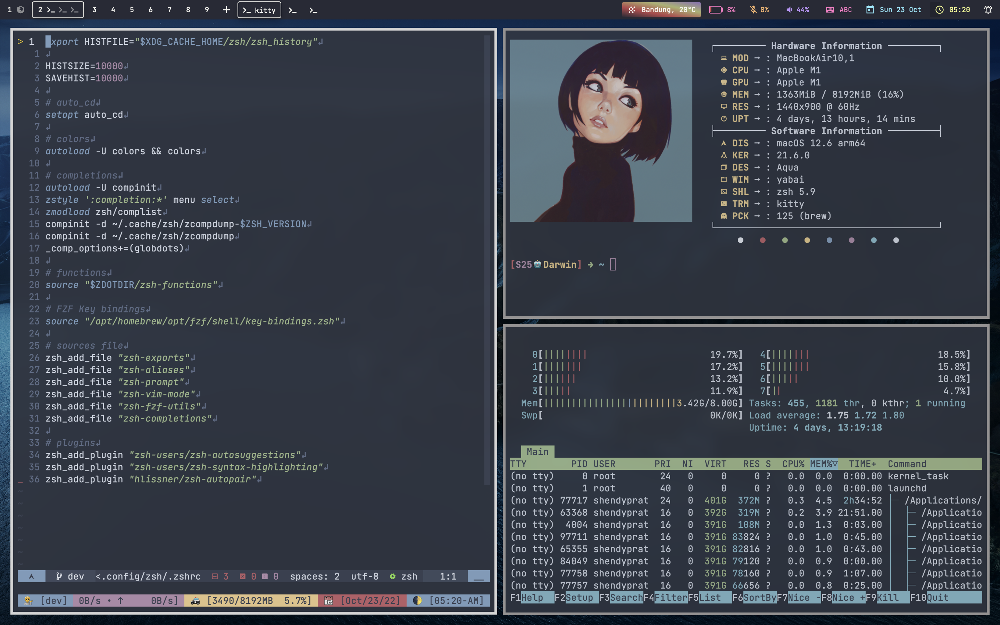

# Personal Development Environment



## Ingredients 🥘

```"info"
Terminal  => [Kitty, Tmux]

Shell     => [Zsh]

Pckg      => [Homebrew]

Vcs       => [Git, Lazygit, Delta]

Editor    => [Neovim 0.7.2]

WM        => [Yabai, Skhd]

Stat      => [Ubersicht, Simple-bar]

Font      => [JetBrains Mono]

Key       => [Karabiner]
```

## Installing

you will need `git` and GNU `stow`

install `git` and `stow` with your fav package manager

Homebrew installation :

```"git"
brew install git
```

```"git"
brew install stow
```

clone into your `$HOME` directory `~`

```"git"
https://github.com/shendypratamaa/.dotfiles.git
```

run `stow` to symlink everything, or select specified config

```"git"
stow */ # Everything (the '/' ignores the README)
```

```"git"
stow zsh # create symlink zsh config | put .zprofile into your $HOME dir
```

## Notes 📖

this work for **UNIX-LIKE**\
im refere using **XDG_CONFIG_SPESIFICATION**\
please read, and get what you want

- [XDG_SPESIFICATION](https://specifications.freedesktop.org/basedir-spec/basedir-spec-latest.html)

don't know, how to configure on Windows machine !!

> _Running on macOS 12.6 Apple Silicon_
